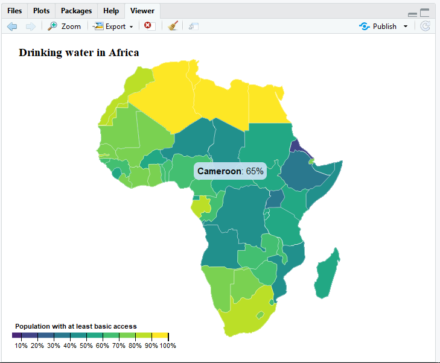

# r2d3maps

> Fun with [`r2d3`](https://github.com/rstudio/r2d3) and [`geojsonio`](https://github.com/ropensci/geojsonio) : draw D3 maps

[](http://www.repostatus.org/#wip)
[](https://www.tidyverse.org/lifecycle/#experimental)


## Installation

You can install from Github:

```r
source("https://install-github.me/dreamRs/r2d3maps")
```

## Examples

Create D3 maps from `sf` objects:




<br>

Try it with NaturalEarth map data from [`rnaturalearth`](https://github.com/ropenscilabs/rnaturalearth) :

```r
library( r2d3maps )
library( rnaturalearth )

### Japan
japan <- ne_states(country = "japan", returnclass = "sf")
r2d3map(shape = japan) %>%
  add_labs(title = "Japan")


### New Zealand
nz <- ne_states(country = "New Zealand", returnclass = "sf")
nz <- sf::st_crop(nz, xmin = 159.104, ymin = -48.385, xmax = 193.601, ymax = -33.669)
r2d3map(shape = nz) %>%
  add_labs(title = "New Zealand")
```


```r
library( r2d3maps )
library( rnaturalearth )

### South America
south_america <- ne_countries(continent = "south america", returnclass = "sf")
r2d3map(shape = south_america) %>%
  add_labs(title = "South America")


### France
fr_dept <- ne_states(country = "france", returnclass = "sf")
fr_dept <- fr_dept[fr_dept$type_en %in% "Metropolitan department", ]

r2d3map(shape = fr_dept) %>%
  add_labs(title = "France")
```


With a shapefile read by `sf`:

```r
library( r2d3maps )
library( sf )

bay_area <- read_sf("dev/bay-area/geo_export_bb694795-f052-42b5-a0a1-01db0b2d41a6.shp")

r2d3map(shape = bay_area) %>%
  add_labs(title = "Bay Area") %>%
  add_tooltip(value = "{po_name}")
```


